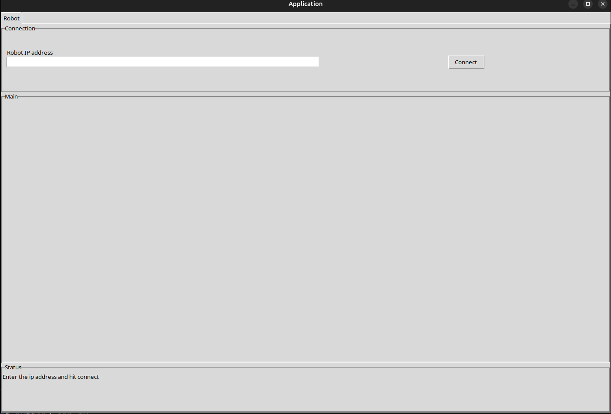

# Python Robotics Automation Template

A comprehensive template for building robotics automation dashboards using Python and Tkinter. This project provides a starting point for creating GUI applications that connect to and control robotic instruments, featuring validated input widgets, real-time communication interfaces, and a modular architecture.



## Features

- **Tkinter-based GUI**: Modern, responsive dashboard interface for robotics control
- **Instrument Communication**: Support for serial and TCP connections to robotic devices
- **Validated Input Widgets**: Custom widgets with real-time validation for user inputs
- **Modular Architecture**: Organized into models, views, and utilities for easy extension
- **Type Safety**: Full mypy support with comprehensive type annotations
- **Testing Ready**: Pytest configuration included for automated testing

## Installation

1. **Clone the repository**:
   ```bash
   git clone <repository-url>
   cd python_automation_template
   ```

2. **Install dependencies**:
   ```bash
   pip install -r requirements.txt
   # or if using Poetry:
   poetry install
   ```

3. **Run the application**:
   ```bash
   python app.py
   ```

## Usage

The template provides a main dashboard (`InstrumentMainPage`) where you can:
- Configure instrument settings through validated form inputs
- Monitor connection status and communication logs
- Send commands and receive responses from connected devices
- Customize widgets and add new instrument types as needed

### Extending the Template

- Add new instrument types in `models.py`
- Create custom widgets in `widgets.py`
- Implement communication protocols in `utils.py`
- Configure new views in the `views/` directory

## Project Structure

```
python_automation_template/
├── app.py                 # Main application entry point
├── conftest.py           # Pytest configuration
├── pyproject.toml        # Project configuration (Poetry, mypy, etc.)
├── pytest.ini           # Pytest settings
├── media/               # Images and media assets
├── python_automation_template/
│   ├── __init__.py
│   ├── models.py        # Data models and settings
│   ├── utils.py         # Communication interfaces and utilities
│   ├── widgets.py       # Custom Tkinter widgets
│   ├── instrument_view.py # Main dashboard view
│   ├── logging_config.py # Logging configuration
│   └── version.py       # Version information
└── settings/            # Application settings
```

## Requirements

- Python 3.8+
- Tkinter (included with Python)
- pyserial (for serial communication)
- Additional dependencies listed in `pyproject.toml`

## Contributing

1. Fork the repository
2. Create a feature branch
3. Make your changes with proper type annotations
4. Add tests for new functionality
5. Submit a pull request

## License

This project is licensed under the MIT License - see the LICENSE file for details.